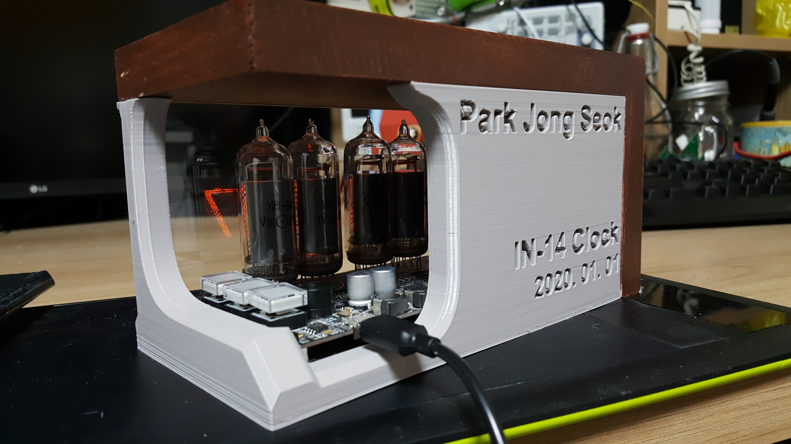
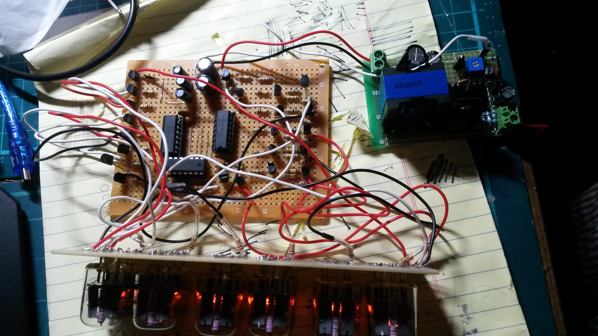

# IN-14 / IN-16 Nixie Clock design based on attiny816.

2019.3.28 ~ 2020.01.01

Software, schemetic, PCB file created by PARK JONG SEOK (박종석)

Contact cakeng@naver.com to
use, modify, or share the software, schemetic, or PCB for any purpose
other than personal use.

PCB/Schematic at https://easyeda.com/cakeng/nixie816 .

## More Pics

PCB

Enclosure 

Old Prototype 

